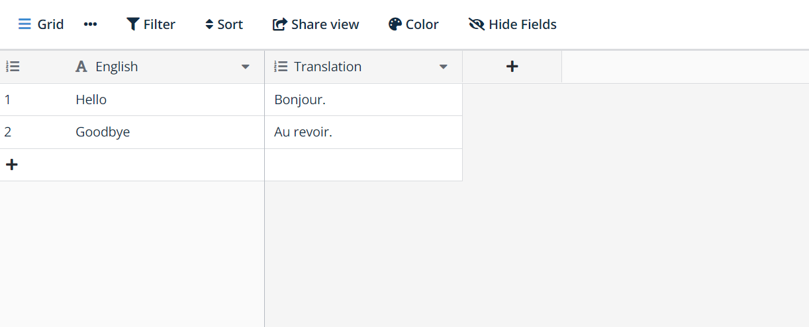

# Creating a Baserow plugin for language  translation (and yes we'll use ChatGPT)

In this tutorial, we'll go over how to create a plugin for the open source online database Baserow. There is existing documentation here: https://baserow.io/docs/plugins%2Fintroduction but in this tutorial we'll go into more detail at every step, and I will share my thoughts as a newcomer to Baserow.

We will introduce two new *field types*:
 1. a **Translation** field, which takes a source field, and translates it from one language to another, for example from English to French.
 2. a **ChatGPT** field, which takes a prompt and more or more source fields, and retrieves output from the OpenAI API.

Here's what the translation field looks like:

And the result:

The ChatGPT field allows you to enter a prompt which references other fields, like this:

And the result:

The full example code is here: https://github.com/Language-Tools/baserow-translate-plugin

 ## Actually, what can Baserow plugins do ?
 At a super high level, Baserow is a Python Django app, and by writing python code, you can extend it in various ways. This tutorial focuses on introducing new *field types* (think Text, Date, Number, Formula, etc) which take input from another field, and produce a result.

 ## Do I need a plugin ?
 As always with programming, start with the most simple solution that works. Baserow has various import methods, a REST API, and webhooks. In most cases, you can use Baserow with no or very little programming. In this case, we are introducing some new logic as well as GUI changes, so the plugin framework is suitable for us.

 ## What are limitations of plugins ?
 Technically, you can do lots of things with plugins, and pretty much customize every aspect of Baserow. Right now, plugins need to be installed offline and deployed in a standalone Baserow instance, there is no such thing as an online marketplace where anyone can install a plugin with a click. If you are familiar with self-hosting apps, this is not a concern.

[Step 1: Get Started](STEP1_GETTING_STARTED.md)